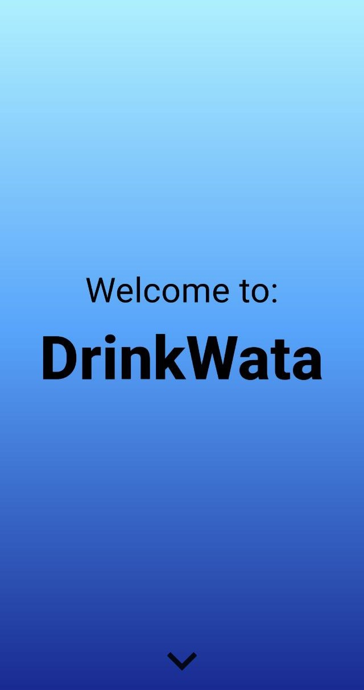
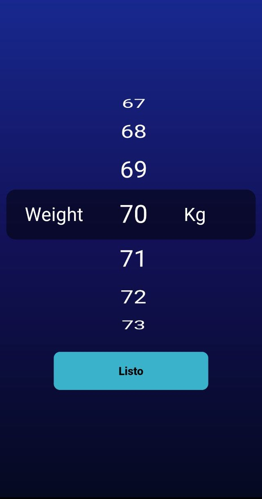
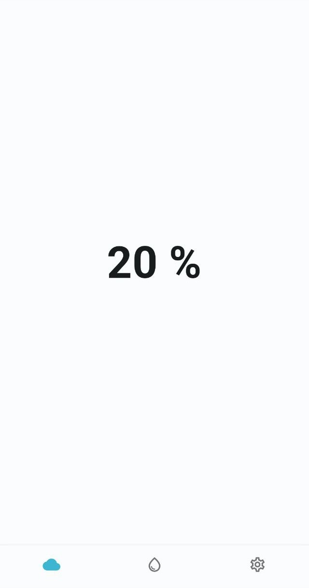
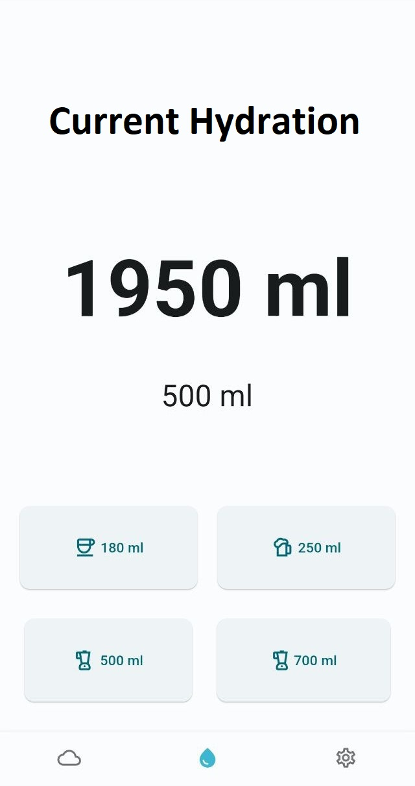
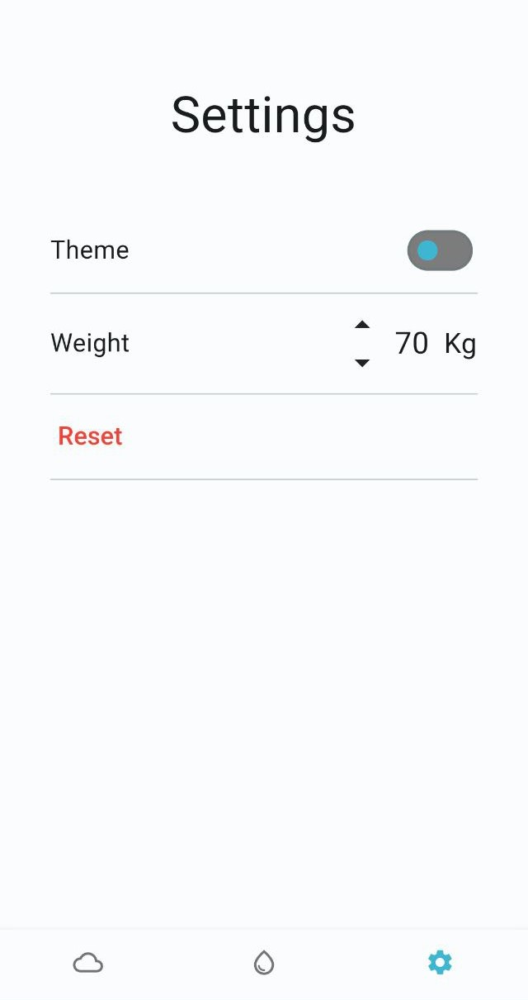

# Recordatorio de tomar agua

## Descripción

Esta aplicacion es un proyecto personal donde pude fortalecer mis habiliades con flutter y poner en practica temas como el manejo de estados utilizando GetX y la utilizacion de Shared Preference para mantener el estado. Esta aplicacion tiene como objetivo recordar a los usuarios que deben tomar agua regularmente.

## Instalación

Para instalar y ejecutar este proyecto, sigue los siguientes pasos:

1. Clona el repositorio en tu máquina local:

   `git clone https://github.com/manuxdev/drinkwata.git`

2. Accede al directorio del proyecto:

   `cd drinkwata`

3. Instala las dependencias del proyecto:

   `flutter pub get`

4. Ejecuta la aplicación en un emulador o dispositivo conectado:

   `flutter run`

## Demo

### Inicio

### Weight Selector

### Home Light

### Whater Light

### Whater Dark

### Settings Light

### Settings Dark

